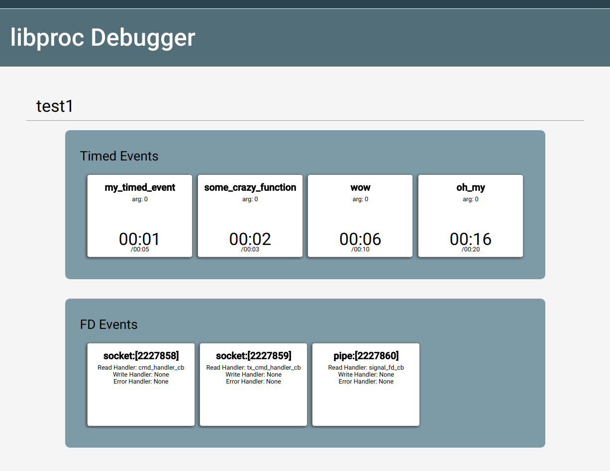

# libproc Debugger

The libproc debugger allows visualizing and logging the contents of the event queue.



## Installation

### Install ZMQ

```bash
echo "deb http://download.opensuse.org/repositories/network:/messaging:/zeromq:/release-stable/Debian_9.0/ ./" >> /etc/apt/sources.list
wget https://download.opensuse.org/repositories/network:/messaging:/zeromq:/release-stable/Debian_9.0/Release.key -O- | sudo apt-key add
sudo apt-get install libzmq3-dev
```

### Build and Install Libproc

```bash
cd <libproc base dir>
make && sudo make install
```

### Install Python Packages

```bash
cd <libproc base dir>/debugger/frontend
conda install --file requirements.txt
```

or with pip:

```bash
cd <libproc base dir>/debugger/frontend
pip install -r requirements.txt
```

## Run the Demo

### Start the Frontend Server

```bash
cd <libproc base dir>
python debugger/frontend/server.py
```

### Build and Run the Test Process

```bash
cd <libproc base dir>/debugger/tests
make
./main
```

Now just navigate to http://localhost:3000 and enjoy!

## Design

The libproc debugger utilizes the EventTimer API to regularly broadcast the contents of the event queue out on a ZMQ socket. A schematic of the diagram is shown below. 


In the provided implementation, the frontend server is a Python web server that displays the data in a webpage. However, in theory the frontend serve could be anything that receives ZMQ data. For example, a frontend server could just be a Python script that simply logs the event queue data to a file.

## Web Frontend Development

The web frontend uses React and Typescript. To get started developing, you will need npm. You can build and launch the server with the following:

```bash
npm install
npm run build
npm run serve
```